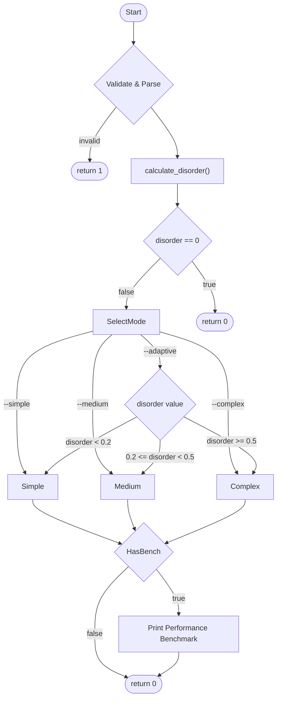

*This project has been created as part of the 42 curriculum by dyanar and ekablan.*

## Description
Push_swap is a sorting algorithm project where we have to sort data using two stacks (a and b) and a very limited set of instructions. The main goal is to sort the numbers using the absolute lowest number of actions. We built an adaptive program that actually analyzes the input and picks the best sorting strategy based on how messy the data is.

## Code Flow



## Instructions
To compile the project, just run:
```bash
make
```
Then run it with a list of numbers:
```bash
./push_swap 4 67 3 87 23
```
We also added some custom flags to test things out and force specific algos:
* `--simple`: forces the O(n²) algo
* `--medium`: forces the O(n√n) algo
* `--complex`: forces the O(n log n) algo
* `--adaptive`: default behavior, picks the algo based on disorder metric
* `--bench`: prints a benchmark of the operations to stderr (super useful for testing)

Tbh there is also a custom unit testing framework included in the source if you want to run the internal tests.

## Explanation and justification of algorithms selected
Instead of just brute forcing one algo, we calculate a **Disorder Metric** before starting. It basically counts the "mistakes" (inversions) divided by the total possible pairs. Depending on the score, we run:

* **Simple Algorithm (Selection Sort) - O(n²)**:
  Runs when disorder < 0.2. It just finds the minimum value, rotates it to the top, and pushes it to stack B. Kinda slow for big random lists but really efficient for almost-sorted arrays or tiny stacks (size <= 5).
* **Medium Algorithm (Chunk Sort) - O(n√n)**:
  Runs when 0.2 <= disorder < 0.5. It calculates a chunk size using a square root method, pushes numbers to stack B in chunks, and then finds the max value to push back to A. Great middle ground for partially sorted stuff.
* **Complex Algorithm (Radix Sort) - O(n log n)**:
  Runs when disorder >= 0.5. We normalize the stack values first (so negative numbers and large gaps don't break the logic), then sort them bit-by-bit using base-2 radix sort. It's the only way to handle completely random, massive inputs efficiently without timing out.

## Resources
* Standard 42 docs and the provided subject pdf
* Wikipedia pages for Radix sort bitwise operations and Chunk sort logic
* Used some AI tools to help generate the boilerplate for our custom unit testing framework and to troubleshoot a few bitwise shift bugs in the radix implementation.
