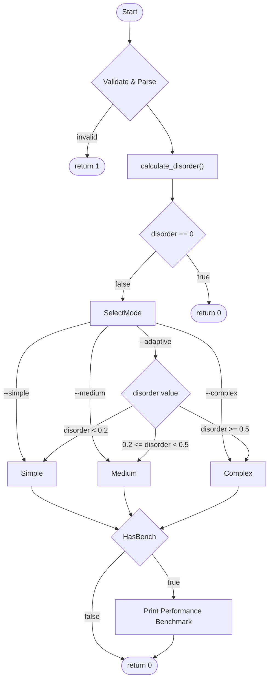

*This project has been created as part of the 42 curriculum by dyanar and ekablan.*

## Description
Push_swap is a sorting algorithm project where we have to sort data using two stacks (a and b) and a very limited set of instructions. The main goal is to sort the numbers using the absolute lowest number of actions. We built an adaptive program that actually analyzes the input and picks the best sorting strategy based on how messy the data is.

## Code Flow


```mermaid
graph TD
    Start([Start]) --> Parser{Validate & Parse}
    Parser -- "invalid" --> Fail
    Parser --> CalculateDisorder["calculate_disorder()"]
    CalculateDisorder --> IsSorted{"disorder == 0"} 
    IsSorted -- "false" --> SelectMode
    IsSorted -- "true" --> End2(["return 0"])
    SelectMode -- "--simple" --> Simple
    SelectMode -- "--medium" --> Medium
    SelectMode -- "--complex" --> Complex
    SelectMode -- "--adaptive" --> CalculatedDisorder{"disorder value"}
    Simple --> HasBench
    Medium --> HasBench
    Complex --> HasBench{HasBench}
    HasBench -- "true" --> PrintBench
    HasBench -- "false" --> End(["return 0"])
    PrintBench["Print Performance Benchmark"] --> End
    CalculatedDisorder -- "disorder < 0.2" --> Simple
    CalculatedDisorder -- "0.2 <= disorder < 0.5" --> Medium
    CalculatedDisorder -- "disorder >= 0.5" --> Complex
    Fail([return 1])
```

## Instructions
To compile the project, just run:
```bash
make
```
Then run it with a list of numbers:
```bash
./push_swap 4 67 3 87 23
```
We also added some custom flags to test things out and force specific algos:
* `--simple`: forces the O(n²) algo
* `--medium`: forces the O(n√n) algo
* `--complex`: forces the O(n log n) algo
* `--adaptive`: default behavior, picks the algo based on disorder metric
* `--bench`: prints a benchmark of the operations to stderr (super useful for testing)

Tbh there is also a custom unit testing framework included in the source if you want to run the internal tests.

## Explanation and justification of algorithms selected
Instead of just brute forcing one algo, we calculate a **Disorder Metric** before starting. It basically counts the "mistakes" (inversions) divided by the total possible pairs. Depending on the score, we run:

* **Simple Algorithm (Selection Sort) - O(n²)**:
  Runs when disorder < 0.2. It just finds the minimum value, rotates it to the top, and pushes it to stack B. Kinda slow for big random lists but really efficient for almost-sorted arrays or tiny stacks (size <= 5).
* **Medium Algorithm (Chunk Sort) - O(n√n)**:
  Runs when 0.2 <= disorder < 0.5. It calculates a chunk size using a square root method, pushes numbers to stack B in chunks, and then finds the max value to push back to A. Great middle ground for partially sorted stuff.
* **Complex Algorithm (Radix Sort) - O(n log n)**:
  Runs when disorder >= 0.5. We normalize the stack values first (so negative numbers and large gaps don't break the logic), then sort them bit-by-bit using base-2 radix sort. It's the only way to handle completely random, massive inputs efficiently without timing out.

# Big O Notation

Big O notation is used in Computer Science to describe the performance or complexity of an algorithm. Specifically, it describes how the execution time or space requirements grow as the input size (usually denoted as `n`) gets larger.

Here is a comprehensive list of the most common time complexities, ordered from fastest (most efficient) to slowest (least efficient).

## The Complexities

* **O(1) - Constant Time:** The operation takes the exact same amount of time regardless of the input size.
* **O(log n) - Logarithmic Time:** The execution time grows slowly as the input size increases. This usually happens when an algorithm divides the problem in half each step (like looking up a word in a dictionary).
* **O(n) - Linear Time:** The execution time grows directly in proportion to the input size. If the input size doubles, the time it takes to run doubles.
* **O(n log n) - Linearithmic Time:** A combination of linear and logarithmic time. This is the baseline for the most efficient comparison sorting algorithms (like Merge Sort or Quick Sort).
* **O(n^2) - Quadratic Time:** The execution time grows proportional to the square of the input size. This is common when you have loops nested inside other loops. 
* **O(2^n) - Exponential Time:** The execution time doubles with each addition to the input data set. This indicates an algorithm that scales very poorly.
* **O(n!) - Factorial Time:** The execution time grows astronomically fast. Usually involves generating all possible permutations of a set.

## C Code Examples

Below is a C program demonstrating the logical structure of these time complexities.

```c
#include <stdio.h>

/* 
 * O(1) - Constant Time
 * Accessing an element by index takes one step, no matter the array size.
 */
void constant_time(int arr[]) {
    printf("First element: %d\n", arr[0]);
}

/* 
 * O(log n) - Logarithmic Time
 * The problem size 'n' is cut in half on every iteration.
 */
void logarithmic_time(int n) {
    int steps = 0;
    while (n > 1) {
        n = n / 2;
        steps++;
    }
}

/* 
 * O(n) - Linear Time
 * The loop runs exactly 'n' times.
 */
void linear_time(int n) {
    for (int i = 0; i < n; i++) {
        // Do something 1 step at a time
    }
}

/* 
 * O(n log n) - Linearithmic Time
 * An O(n) loop containing an O(log n) loop.
 */
void linearithmic_time(int n) {
    for (int i = 0; i < n; i++) {
        int j = n;
        while (j > 1) {
            j = j / 2;
        }
    }
}

/* 
 * O(n^2) - Quadratic Time
 * An inner loop runs 'n' times for every 'n' iteration of the outer loop.
 */
void quadratic_time(int n) {
    for (int i = 0; i < n; i++) {
        for (int j = 0; j < n; j++) {
            // Do something
        }
    }
}

/* 
 * O(2^n) - Exponential Time
 * Each function call branches into two more recursive calls.
 * Example: The naive Fibonacci sequence calculation.
 */
int exponential_time(int n) {
    if (n <= 1) return n;
    return exponential_time(n - 1) + exponential_time(n - 2);
}

/* 
 * O(n!) - Factorial Time
 * The loop runs 'n' times, and calls itself recursively for 'n-1', 
 * creating n * (n-1) * (n-2)... branches. 
 */
void factorial_time(int n) {
    if (n == 0) return;
    for (int i = 0; i < n; i++) {
        factorial_time(n - 1);
    }
}
```

## Resources
* Standard 42 docs and the provided subject pdf
* Wikipedia pages for Radix sort bitwise operations and Chunk sort logic
* Used some AI tools to help generate the boilerplate for our custom unit testing framework and to troubleshoot a few bitwise shift bugs in the radix implementation.
